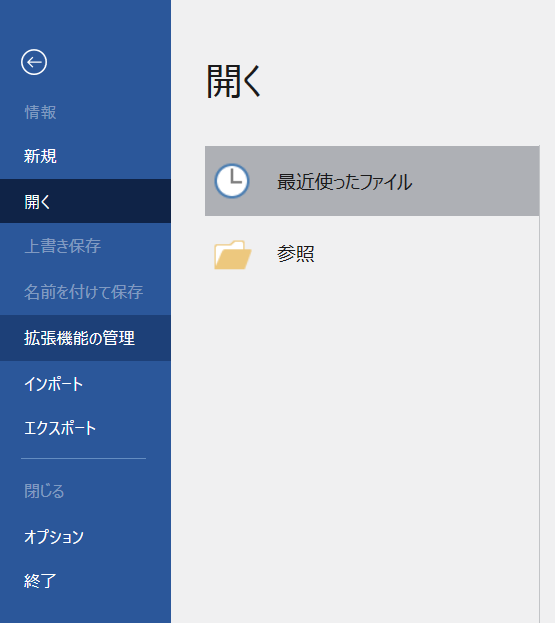
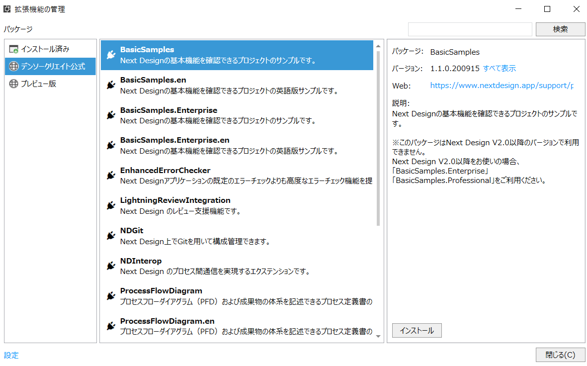
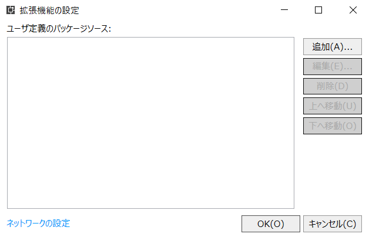
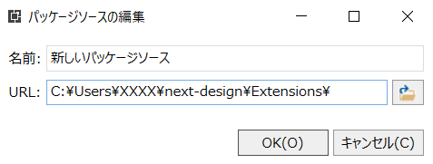
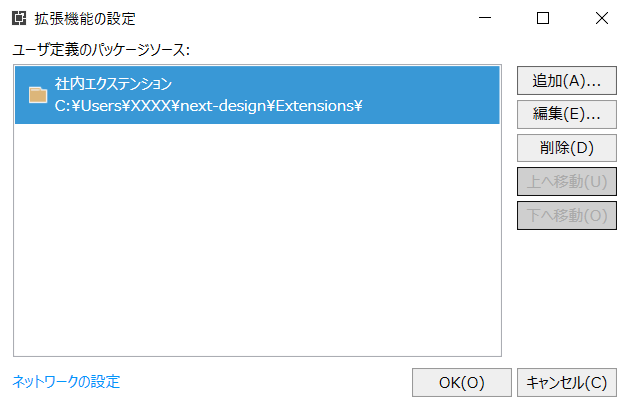
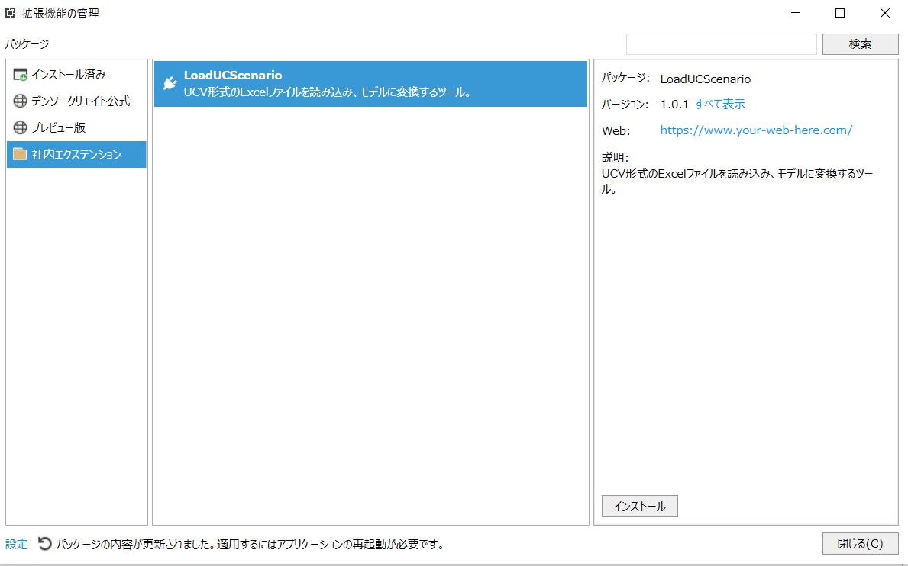

# エクステンションのインストール

社内で作成、共有しているエクステンションを、Next Designにインストールする手順を示す。

## 1. エクステンションパッケージリポジトリの取得

Next Designのエクステンションパッケージは、Gitリポジトリで管理している。エクステンションの配布は、このリポジトリを使用して行う。

Next Designを使用しているPCで、以下のエクステンションパッケージ管理用Gitリポジトリを取得する。あらかじめGitをインストールし、リポジトリへのアクセス権を取得しておくこと。

https://github.com/???/Extensions

リポジトリの取得手順例を以下に示す。

```PowerShell
% git clone https://github.com/???/Extensions
% ls
Extensions/
%
```

## 2. エクステンションのインストール

Next Designのエクステンションのインストール手順を示す。

**(1) Next Designを起動する**

**(2) メニューから`ファイル`を選択し、以下の画面を表示する**



**(3) `拡張機能の管理`をクリックし、拡張機能の管理画面を表示する**



**(4) 拡張機能の管理画面の左下の`設定`リンクをクリックし、拡張機能の設定ダイアログを表示する**



**(5) 拡張機能の設定ダイアログから`追加(A)...`ボタンを押し、パッケージソースの編集ダイアログを表示する**



**(6) パッケージソースの編集ダイアログで、名前とURL（git cloneしたディレクトリのパス）を指定し、`OK(O)`ボタンを押す**



**(7) 上記のような拡張機能の設定ダイアログが表示されるので、`OK(O)`ボタンを押して拡張機能の管理ダイアログを表示する**



**(8) 拡張機能ダイアログからインストールしたいエクステンションを選択し、`インストール`ボタンを押してインストールする**

以上
