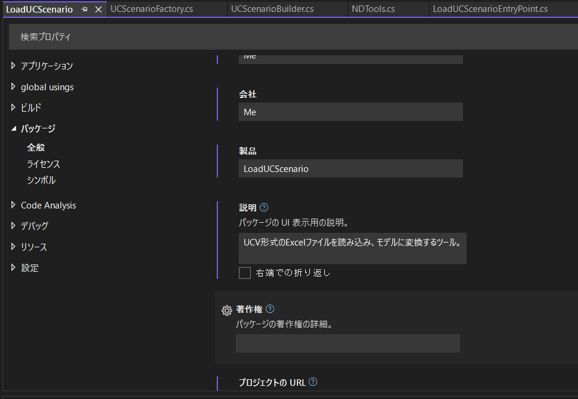
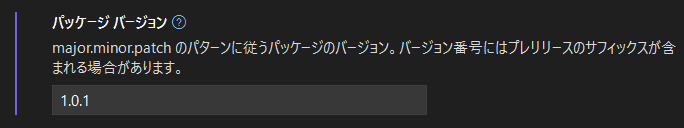
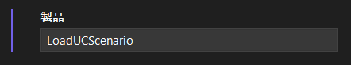
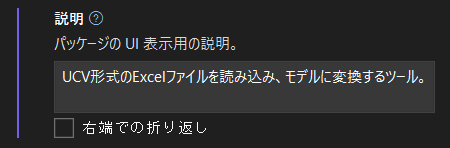
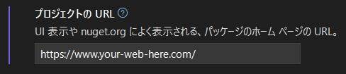

# エクステンションの作り方

Next Designエクステンションの作成手順について述べる。

## 1. エクステンション開発の環境構築とチュートリアル

エクステンションの開発環境の構築、プロジェクトの作成等は、以下のページを参照。

[Next Design エクステンション開発マニュアル](https://docs.nextdesign.app/extension/)

* [クイックスタート](https://docs.nextdesign.app/extension/docs/getting-started/intro)
  * Visual Studioや .NET SDK等、必要なソフトウェアについて
  * プロジェクトの作成からエクステンションのNext Designへのインストールまでの説明をざっと読んでから、チュートリアルを読むと良い
* [チュートリアル](https://docs.nextdesign.app/extension/docs/tutorials/hello-world)

## 2. パッケージ情報の設定

ここで使用している用語「パッケージ」は、.NETを使用したDLLを含む実行可能なソフトウェアをまとめたもので、一般的に .NETパッケージと呼ばれているものを指す。Next Designのエクステンションは、この .NETパッケージに変換して配布、提供する。

Visual Studioでエクステンションを配布する際は、必ずここで示すパッケージ情報を設定すること。

パッケージ情報の表示手順を以下に示す。

1. Visual Studioでエクステンションのソリューションを開く
2. ソリューションエクスプローラからプロジェクトを選択する
3. 右クリックメニューから`プロパティ(R)`をクリックする
4. プロパティ画面が開くので、画面左側のサイドメニューから`パッケージ`をクリックする

以下のようなパッケージ情報の画面が表示される。



参考：[プロジェクトおよびソリューションのプロパティの管理](https://learn.microsoft.com/ja-jp/visualstudio/ide/managing-project-and-solution-properties)

設定が必要なパッケージ情報を順に示す。

### 2-1. パッケージバージョン



パッケージバージョンのフォーマットは、 .NETのNuGetに依存している。具体的には以下の通り。

```
<X>.<Y>.<Z>[-<suf>]

<X> : メジャーバージョン（重大な変更）
<Y> : マイナーバージョン（新機能、下位互換のある変更）
<Z> : パッチ（下位互換性のあるバグ修正）
<suf> : プレリリースバージョン、省略可
```

以下にバージョン表記の例を示す。未サポートのバージョン表記は正しく表示されないため、注意すること。

```
サポートしているバージョン表記
1.0.1
6.11.1231
4.3.1-rc
2.2.44-beta.1

未サポートのバージョン表記
1.01
06.01.03
v1.2.3
```

参考：[パッケージのバージョン管理](https://learn.microsoft.com/ja-jp/nuget/concepts/package-versioning)

### 2-2. 製品



デフォルトでパッケージ名がセットされている。
必要ならば変更する。

### 2-3. 説明



パッケージの説明文を記載する。
Next Designのエクステンション一覧で表示される内容なので、ユーザ向けの文章を記載すること。

### 2-4. プロジェクトのURL



パッケージを管理するWebページのURLを記載する。
エクステンションのGitリポジトリにREADME.mdがあり、そちらで説明があるならば、そのURLでも良い。

### 2-5. その他

上記以外に以下のパッケージ情報を設定することができる。ただし、これらはNext Designから閲覧できない情報のため、省略しても影響はない。

* タイトル
* 作成者
* 会社
* 著作権
* アイコン
* README
* リポジトリURL
* リポジトリの種類
* タグ
* リリースノート

## 3. エクステンションのパッケージ化

エクステンションを配布するための、パッケージ化手順を示す。

### 3-1. ツールの準備

エクステンションをパッケージ化するには、Next Design提供のツール`NDExt`を使用する。

NDExtのインストール方法は、以下のページを参照。

[Next Design Extension：NDExt](https://docs.nextdesign.app/extension/docs/tools/ndext/intro)

NDExtは内部で`nuget.exe`を使用しており、別途nuget.exeコマンドを入手する必要がある。ダウンロードしたnuget.exeは、すでにインストール済みであるdotnetの以下のディレクトリ下にコピーするとすぐに使用できる。

```
C:\Program Files\dotnet\
```

### 3-2. パッケージ作成手順

ソリューションファイルのあるディレクトリで`NDExt pack`コマンドの実行すると、パッケージが作成できる。

以下に実行例を示す。

```PowerShell
% cd LoadUCScenario/
% ls
LoadUCScenario/  LoadUCScenario.sln
% ndext pack
# ===============================================================
#
# Next Design Extension Utility - Version 1.3.0.0
#
# ===============================================================
エクステンションをパッケージ化しています...


==========> Packaging Project <=========================
[in] TargetProject: LoadUCScenario.csproj
[in] Build Target: Release
[in] ND Version: 3.0
========================================================


#------------------------------------------------------------
# Build Project
#------------------------------------------------------------
復元が完了しました (0.5 秒)

  LoadUCScenario 成功しました (7.5 秒) → LoadUCScenario\bin\Release\net6.0-windo
ws\publish\

8.8 秒後に 成功しました をビルド

#------------------------------------------------------------
# Packaging
#------------------------------------------------------------
'LoadUCScenario.nuspec' からパッケージをビルドしようとしています。
パッケージ 'C:\Users\kioto\project\HGSC\next-design\nd_extensions\LoadUCScenario
\ndpackages\LoadUCScenario.1.0.1.nupkg' が正常に作成されました。

#------------------------------------------------------------
# Done
#------------------------------------------------------------
パッケージ化を完了しました。

% ls
LoadUCScenario/  LoadUCScenario.sln  ndpackages/
% ls ndpackages
LoadUCScenario.1.0.1.nupkg
%
```

上記の`LoadUCScenario.1.0.1.nupkg`がパッケージファイルである。

## 4. 配布

（リポジトリに登録する手順）

以上
